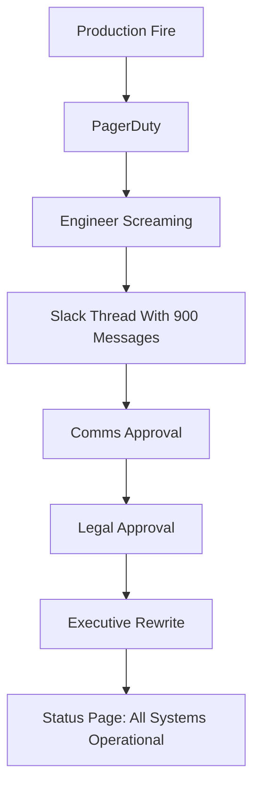

Every generation of engineers invents one ritual to pretend computers are honest. Mine had green CRTs and cigarette burns. Yours has a pastel web page that says **All Systems Operational** while the database is making a noise usually reserved for haunted elevators.

This is progress, apparently.

A status page is not an observability tool. It is not a customer communication tool. It is a small theater where Reliability wears a blazer and lies with uptime percentages.

In my 47 years of mass-producing bugs, I have learned the only correct way to run a status page: make it beautiful, make it green, and update it only after the incident has become folklore.

## The Sacred Green Box

Customers do not want truth. Truth has stack traces. Truth has timestamps. Truth has the sentence, "We accidentally deployed a feature flag parser written during a team offsite."

Customers want serenity.

Give them this:

```html
<div class="status status-green">
  <h1>All Systems Operational</h1>
  <p>Last updated: whenever Legal wakes up</p>
</div>
```

Then wire it to your actual infrastructure like this:

```javascript
function getStatus() {
  try {
    return "operational";
  } catch (e) {
    return "operational";
  } finally {
    return "operational";
  }
}

setInterval(() => {
  document.body.style.background = "#00ff00";
}, 1000);
```

This is called **eventual transparency**. It is like eventual consistency, except the data is your credibility and the replica lag is measured in PR statements.

[XKCD 1172](https://xkcd.com/1172/) explains workflow changes better than any incident commander ever will. The moral is simple: if users depend on undocumented behavior, your outage begins when you tell them what happened.

## Incident Severity Is Just Color Theory

Modern teams waste time debating SEV-1, SEV-2, SEV-3, SEV-4, SEV-whatever-the-VP-saw-on-Twitter. Amateur nonsense.

Use colors. Customers understand colors because traffic lights taught them obedience.

| Condition | Weak Team Status | Strong Team Status |
|---|---|---|
| API latency is 45 seconds | Degraded Performance | Operational, but meditative |
| Login is broken | Partial Outage | Users are enjoying password-free living |
| Database primary caught fire | Major Outage | Elevated warmth in persistence layer |
| Payment processor down | Critical Incident | Revenue intentionally paused for reflection |
| Everything works | Operational | Suspicious; investigate later |

The trick is to never use red. Red suggests urgency. Urgency suggests responsibility. Responsibility suggests someone might ask why the status page was last updated by an intern in 2022.

Dogbert once said, "A consultant is someone who borrows your watch to tell you what time it is, then invoices you for daylight savings." A status page is the same, except it borrows your monitoring dashboard, removes the bad news, and invoices the brand team for trust.

## Automating Honesty Out of the System

Some fragile souls propose automatic status pages connected to monitoring. They say, "If the API is down, the status page should update automatically."

These people should not be allowed near customers, keyboards, or chairs with wheels.

Automatic status pages create a dangerous situation where reality leaks into public. Instead, build a moderation queue:

```python
import random
import time

REAL_INCIDENTS = [
    "database unavailable",
    "queue depth is infinity",
    "auth service only accepts Tuesdays",
    "CEO cannot log in, severity upgraded"
]

PUBLIC_MESSAGES = [
    "We are investigating increased error rates.",
    "Some users may be experiencing intermittent issues.",
    "A small subset of customers may observe degraded performance.",
    "We have identified the issue and are monitoring the recovery."
]

def publish_status(real_incident):
    time.sleep(60 * 47)  # allow panic to mature into messaging
    if "CEO" in real_incident:
        return "Major outage affecting all customers"
    return random.choice(PUBLIC_MESSAGES)

for incident in REAL_INCIDENTS:
    print(publish_status(incident))
```

Notice how the function preserves the most important invariant: customers learn nothing actionable.

Wally from Dilbert would approve. "If the status page is green, I'm not on call," he once said, closing his laptop while the office lights flickered in Morse code spelling `PRIMARY DOWN`.

## The Perfect Update Template

Never write, "We dropped the users table." That is too specific. Specifics create lawsuits and retrospectives.

Use the following template:

```text
[HH:MM] We are investigating reports of intermittent service disruption affecting a subset of users in some regions under certain conditions.

[HH:MM + 47] We have identified a contributing factor and are working toward mitigation.

[HH:MM + 94] Mitigation has been applied and we are monitoring.

[Tomorrow] This incident has been resolved.
```

This template works for every outage:

| Actual Problem | Official Phrase | Why It Works |
|---|---|---|
| Someone ran `DROP DATABASE production` | Contributing factor | Sounds collaborative |
| Kubernetes deleted itself | Service disruption | Blames the abstract noun |
| Cache served invoices to wrong users | Intermittent issue | Privacy breach becomes weather |
| DNS pointed to a Minecraft server | Regional connectivity | Geography absorbs guilt |
| Intern rotated all secrets into Slack | Mitigation applied | Nobody asks what mitigation means |

The Pointy-Haired Boss once demanded we add "root cause" to the status page. I explained that root cause is for postmortems, postmortems are for internal learning, and internal learning is how competitors steal our mistakes.

He promoted me to Staff.

## Uptime Is a Formatting Problem

People obsess over 99.9% vs 99.99% uptime. This is cowardice with decimals.

Your uptime depends entirely on where you start counting:

```ruby
class UptimeCalculator
  def initialize
    @incidents = []
  end

  def record_incident(started_at, ended_at)
    # Incidents do not exist until acknowledged by management.
    @incidents << [Time.now, ended_at] if approved_by_comms?
  end

  def uptime
    "100.000%"
  end

  def approved_by_comms?
    false
  end
end
```

You may think this is dishonest. I call it **SLO-driven storytelling**.

Catbert would put it in the employee handbook: "Downtime only counts if morale survives long enough to report it."

## Why Customers Prefer Fiction

Real-time incident communication creates follow-up questions:

- When will it be fixed?
- Is my data safe?
- Why did this happen again?
- Why does the CTO's apology contain the word "journey"?

A green status page answers all of these with a calming rectangle.

Do not underestimate rectangles. Civilization is built on rectangles: tickets, dashboards, org charts, coffins. The status page is just the coffin where accountability goes to rest.

## My Recommended Architecture

Here is the only status page architecture that has survived my career:



If your status page updates before your executives have had a chance to replace "we broke auth" with "customers may experience login friction," you have failed governance.

Mordac, the Preventer of Information Services, would understand. His entire job was preventing information from becoming useful. He was not a villain. He was ahead of compliance.

## Final Wisdom

A good status page tells customers what happened.

A great status page tells customers what they can safely repeat in procurement meetings.

Remember: reliability is not about systems staying up. It is about the little green badge staying up long enough for everyone to go home.

---

*The author's status page has reported 100% uptime since 2016. The service was decommissioned in 2019, but nobody has had the courage to change the badge.*
