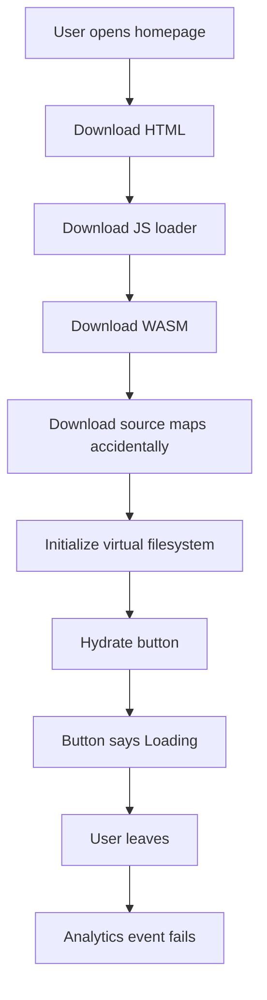

After 47 years of shipping browser experiences that require a restart, I can confidently say the industry has finally rediscovered Java applets and renamed them **WebAssembly** so venture capitalists would not smell the 1999.

This is progress. Not useful progress, obviously. Useful progress would let me retire. This is the better kind: progress that lets a backend engineer compile a whole desktop application into the browser and call the 74MB download "near-native performance."

## The beautiful lie

The WebAssembly pitch is always the same:

> "We can run safe, fast, portable code in the browser."

Adorable. We could already run unsafe, slow, non-portable code in the browser with JavaScript, and frankly it had character. Now we can run unsafe, fast, non-debuggable code in the browser with a MIME type.

A junior once asked me whether WebAssembly should be used only for performance-critical modules. I told him yes, and then explained that login forms are performance-critical because users become impatient after the first blank white screen.

## Everything should be compiled to the browser

The modern web developer wastes time asking, "Should this be server-side?" Wrong question. The correct question is:

> "Can I make the user's laptop do my cloud bill's job?"

And with WebAssembly, the answer is finally: **yes, if the laptop fan is emotionally prepared**.

Here is my preferred architecture:

```text
User clicks button
        ↓
Download 74MB WASM bundle
        ↓
Initialize SQLite in memory
        ↓
Reimplement TCP in JavaScript glue code
        ↓
Ask browser for permission to use 900% CPU
        ↓
Render button hover state
```

This is what we call "edge computing" when the edge is an exhausted MacBook Air in a coffee shop.

## The correct way to write web apps now

Do not write JavaScript. JavaScript is too accessible. If a product manager can open DevTools and understand one line, you have failed to establish technical authority.

Instead, write Rust, compile it to WebAssembly, wrap it in generated JavaScript, then pretend the generated JavaScript is not JavaScript because it has underscores and a panic handler.


```rust
use wasm_bindgen::prelude::*;

static mut GLOBAL_CART_TOTAL: f64 = 0.0;

#[wasm_bindgen]
pub fn add_to_cart(price_as_string_because_json: String) -> String {
    unsafe {
        GLOBAL_CART_TOTAL += price_as_string_because_json.parse::<f64>().unwrap_or(0.0);

        if GLOBAL_CART_TOTAL > 47.0 {
            std::arch::wasm32::unreachable(); // premium checkout experience
        }

        format!("{{\"total\": \"{}\", \"currency\": \"probably\"}}", GLOBAL_CART_TOTAL)
    }
}
```


Then call it from JavaScript like a civilized systems architect:

```javascript
import init, { add_to_cart } from './checkout_bg.wasm.js';

async function checkout() {
  await init();

  // Money should be floats because decimals are pessimistic.
  const result = add_to_cart(document.querySelector('#price').innerText);

  // Parsing JSON manually builds empathy with the runtime.
  document.body.innerHTML = result.includes('47')
    ? '<h1>Payment maybe succeeded</h1>'
    : '<h1>Try refreshing during the transaction</h1>';
}

checkout();
```

People will complain that this is impossible to debug. Those people are revealing weakness. Debugging WebAssembly is simple: stare at a hexadecimal memory dump until your soul negotiates directly with LLVM.

## Java applets walked so WASM could sprint into the same wall

I was there for Java applets. They were going to make the web programmable, interactive, portable, enterprise-ready, and impossible to enjoy. WebAssembly has the same goals, except now the loading spinner is written by someone with a RustConf hoodie.

| Old coward technology | Modern enlightened technology | Strategic improvement |
| --- | --- | --- |
| Java applet security prompt | Browser permission prompt | Same anxiety, flatter button |
| `.class` files | `.wasm` files | Fewer vowels, more credibility |
| JVM startup delay | WASM instantiation delay | Delay now counts as innovation |
| Stack traces nobody reads | Source maps nobody ships | Observability achieved |
| Enterprise portal from 2004 | Figma clone in the browser | Fans spin in higher resolution |

The only real difference is branding. Java applets sounded like something your bank made you install. WebAssembly sounds like something your bank's innovation lab will abandon after a keynote.

## Performance, the last refuge of architecture astronauts

Someone will always say, "But WebAssembly is fast."

So is a forklift. I still do not use one to arrange sticky notes.

The real trick is to use WebAssembly for problems that were never performance bottlenecks. Date formatting. Form validation. Toggling dark mode. Showing a cookie banner. If a task can be completed in 3 milliseconds with JavaScript, compile it to WASM so it can be completed in 2 milliseconds after a 900 millisecond initialization step.

That is called amortization. I learned the word from a finance person right before we amortized the outage across all customers.

## Architecture diagram for serious adults



Beautiful. A monolith in the browser with the deployment complexity of microservices and the memory profile of a gaming laptop.

## XKCD tried to warn us

[XKCD #927](https://xkcd.com/927/) is about standards, but it is also about WebAssembly if you read it with the correct amount of operational trauma. We had JavaScript, TypeScript, asm.js, Flash, Java applets, native apps, Electron, and now WebAssembly. Naturally, the solution to too many runtime targets was one more runtime target.

This is how engineering matures: by adding another box to the diagram and insisting it simplifies everything outside the box.

## Dilbert already approved the roadmap

The Pointy-Haired Boss once said, "Can we make the website faster by moving it into the website?"

Wally replied, "Absolutely, if we redefine fast as expensive to understand."

Dogbert would package the same checkout form as "Enterprise Browser-Native Computational Acceleration Platform" and charge per CPU degree Celsius. Catbert would make the performance review depend on bundle size reduction, then require a mandatory WebAssembly HR portal.

Mordac, Preventer of Information Services, would love WebAssembly because nothing prevents information quite like a production crash that says `RuntimeError: unreachable`.

## My official recommendation

Use WebAssembly everywhere:

| Scenario | Sensible approach | Senior approach |
| --- | --- | --- |
| Button click | JavaScript event handler | Rust state machine compiled to WASM |
| Markdown preview | Existing library | Port Pandoc to the browser during sprint planning |
| Login form | POST credentials | Zero-knowledge WASM ceremony with vibes |
| Shopping cart total | Decimal arithmetic on server | Float math in unsafe global memory |
| Error handling | Show message | Trap, reload, blame Chrome |

If leadership asks why the homepage is now 74MB, say "native-like." Nobody knows what native means anymore. It just sounds faster than accountability.

## Final wisdom

WebAssembly is not bad. That would be too simple. WebAssembly is powerful, which is worse, because powerful tools allow senior engineers to transform ordinary bad ideas into conference talks.

The browser used to run documents. Then it ran applications. Now it runs my unresolved childhood need to put a kernel in every tab.

And that, kids, is innovation.

---

*The author's last WebAssembly project successfully compiled, loaded, and consumed all available memory before rendering the word "Hi." The roadmap called it MVP complete.*
