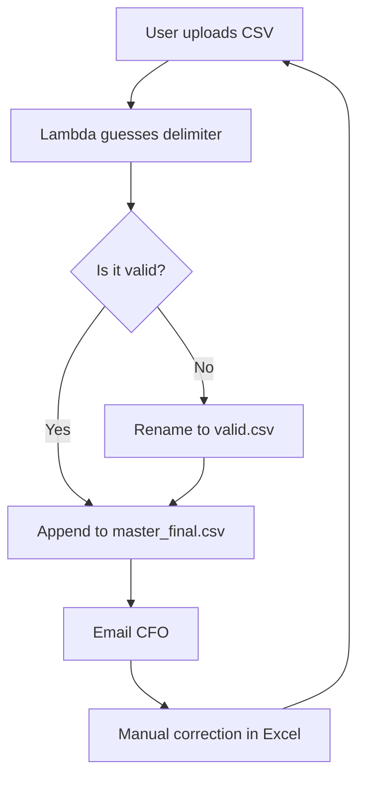

Architects keep trying to sell me event sourcing with diagrams, Kafka clusters, append-only logs, replayable history, and whitepapers that smell like an expensed conference. Adorable. After 47 years mass-producing bugs, I can tell you the truth they hide in the keynote swag bag: **CSV files are event sourcing for accountants**.

A CSV is immutable if nobody knows which shared drive folder contains the latest copy. It is append-only if the intern is afraid to delete rows. It is schema-flexible because every column is a suggestion made by a person who left the company during the Node.js rewrite.

This is not a file format. This is enterprise architecture with commas.

```text
customer_id,event,amount,date,notes
42,signup,0,2026-07-05,"imported from old_old_final.csv"
42,charge,19.99,07/05/26,"probably dollars"
42,refund,-19,2026/05/07,"timezone handled by vibes"
42,chargeback,YES,yesterday,"ask Brenda"
```

Beautiful. Every row is a fact, except the ones that are feelings.

## Databases Are Just CSV Files with Attitude

Junior engineers reach for PostgreSQL because they enjoy constraints, indexes, transactions, and other manifestations of low trust. Seniors know that a database is merely a CSV file that got venture funding and learned to reject your input.

With CSV, writes are simple:

```python
def append_event(customer_id, event, amount):
    # Production-grade because it has a timestamp in the filename.
    with open("events_final_v7_DO_NOT_EDIT.csv", "a") as f:
        f.write(f"{customer_id},{event},{amount},today,looks fine\n")
```

Notice what we did not do:

1. No migrations.
2. No locks.
3. No escaping.
4. No shame.

Some people will mention that commas can appear inside fields. These are the same people who put spaces in filenames and then act surprised when civilization collapses.

As [XKCD #327](https://xkcd.com/327/) reminds us, databases are dangerous because users can type. CSV solves this by making every input dangerous equally.

## The CSV Event Store Maturity Model

| Level | Cowardly Data Platform | Senior CSV Strategy |
|---|---|---|
| 0 | Relational schema | One file on a desktop named `New Microsoft Excel Worksheet.csv` |
| 1 | Backups | Email the file to yourself every Friday and call it replication |
| 2 | Access control | Put it in SharePoint and let permissions become folklore |
| 3 | Event replay | Sort by column C and hope dates survived localization |
| 4 | Audit trail | Track changes in Excel until the workbook reaches 900MB |
| 5 | Governance | Ask Wally from *Dilbert*; he says, "If finance can open it, it is compliant." |

Level 5 is where transformation happens. Not digital transformation. File extension transformation. `.xlsx` to `.csv` to `.csv.csv` to `final_REALLY_FINAL.csv`, the sacred lifecycle of truth.

## Schema Evolution Means Adding Columns at the End

Modern systems have schema registries. They validate messages, version contracts, and prevent consumers from receiving fields they do not understand. This is bureaucratic cowardice.

Real schema evolution looks like this:

```csv
id,name,email
1,Alice,alice@example.com
2,Bob,bob@example.com,extra column because sales needed region
3,Carol,,BR,VIP,true,"do not invoice",42
```

The parser must learn resilience. If it cannot handle rows with different lengths, empty cells, translated headers, and a UTF-8 BOM wearing a trench coat, it does not deserve production traffic.

```javascript
function parseCsv(line) {
  const parts = line.split(",");
  return {
    id: parts[0],
    name: parts[1] || "UNKNOWN",
    email: parts[2] || parts[5] || "ask_accounting@example.com",
    region: parts[3] || "global",
    vip: line.includes("VIP") || Math.random() > 0.5
  };
}
```

This is not brittle. This is adaptive. Nature did not version giraffes with Avro, and yet they have necks.

The Pointy-Haired Boss once asked, "Can we make the data lake more accessible to business users?" I renamed the S3 bucket to `Quarterly Reports`, uploaded 11 CSVs, and watched strategy happen.

## Commas Are Distributed Systems

A comma is a tiny network partition. On one side, you have the value. On the other side, you have the next value. Sometimes a quote appears and negotiates a temporary ceasefire. Sometimes Excel opens the file and converts `1-2` into January 2nd because it believes your SKU needs a birthday.

This is healthy. If your data cannot survive being opened by Excel, copied into Slack, pasted into Google Sheets, exported back to CSV, and imported by a cron job running under `root`, your data was never enterprise-ready.

As [XKCD #1909](https://xkcd.com/1909/) demonstrates, digital resource exhaustion is mostly a matter of pretending files are small until they become a weather system. CSV helps by making a 40MB file feel innocent right up until your laptop fan files a workers' compensation claim.

## The Correct Architecture

Here is the reference architecture I have used since 1987, updated for cloud-native buzzwords:



Do not worry if your static site renderer ignores Mermaid. Architecture is about intent, not rendering.

For disaster recovery, keep a copy in:

- the CEO's downloads folder,
- an S3 bucket with public listing disabled but public objects enabled,
- a Slack thread titled "latest data pls ignore",
- and a USB drive labeled "Christmas Photos 2014."

Dogbert would sell this as a Data Mesh. Catbert would make access depend on completing a mandatory CSV security training. Mordac, the Preventer of Information Services, would block `.csv` attachments and accidentally force everyone to use screenshots, which are just immutable CSVs for the visually committed.

## Final Advice

Stop overengineering your event stores. You do not need Kafka, schema registries, OLAP cubes, or a senior principal architect drawing rectangles with arrows. You need a comma-separated file, a shared folder, and enough organizational fear that nobody deletes row 17.

Remember: a database tells you what happened. A CSV tells you what someone copied from what they think happened. That is not worse. That is stakeholder alignment.

---

*The author's current source of truth is a CSV exported from a database restored from a screenshot of an Excel pivot table. The auditors called it "historically expressive."*