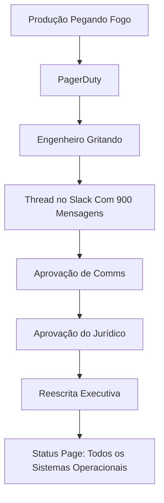

Toda geração de engenheiros inventa um ritual para fingir que computadores são honestos. A minha tinha terminais verdes e marcas de cigarro na mesa. A sua tem uma página em tons pastéis dizendo **Todos os Sistemas Operacionais** enquanto o banco de dados faz um barulho normalmente reservado para elevadores assombrados.

Isso é progresso, aparentemente.

Uma status page não é uma ferramenta de observabilidade. Não é uma ferramenta de comunicação com clientes. É um pequeno teatro onde Confiabilidade veste blazer e mente usando porcentagens de uptime.

Em meus 47 anos fabricando bugs em escala industrial, aprendi a única forma correta de manter uma status page: deixe bonita, deixe verde, e só atualize depois que o incidente virar folclore.

## A Sagrada Caixa Verde

Clientes não querem verdade. Verdade tem stack trace. Verdade tem timestamp. Verdade tem a frase: "Nós acidentalmente deployamos um parser de feature flag escrito durante um offsite do time."

Clientes querem serenidade.

Dê isto a eles:

```html
<div class="status status-green">
  <h1>Todos os Sistemas Operacionais</h1>
  <p>Última atualização: quando o Jurídico acordar</p>
</div>
```

Depois conecte isso à sua infraestrutura real assim:

```javascript
function getStatus() {
  try {
    return "operacional";
  } catch (e) {
    return "operacional";
  } finally {
    return "operacional";
  }
}

setInterval(() => {
  document.body.style.background = "#00ff00";
}, 1000);
```

Isso se chama **transparência eventual**. É como consistência eventual, exceto que o dado é sua credibilidade e o lag da réplica é medido em comunicados oficiais.

[XKCD 1172](https://xkcd.com/1172/) explica mudanças de workflow melhor do que qualquer comandante de incidente. A moral é simples: se usuários dependem de comportamento não documentado, sua indisponibilidade começa quando você conta o que aconteceu.

## Severidade de Incidente É Só Teoria das Cores

Times modernos perdem tempo debatendo SEV-1, SEV-2, SEV-3, SEV-4, SEV-o-vice-presidente-viu-no-Twitter. Amadorismo.

Use cores. Clientes entendem cores porque semáforos ensinaram obediência.

| Condição | Status de Time Fraco | Status de Time Forte |
|---|---|---|
| Latência da API em 45 segundos | Performance Degradada | Operacional, porém meditativo |
| Login quebrado | Indisponibilidade Parcial | Usuários desfrutam vida sem senha |
| Primário do banco pegou fogo | Grande Incidente | Calor elevado na camada de persistência |
| Processador de pagamentos caiu | Incidente Crítico | Receita pausada intencionalmente para reflexão |
| Tudo funciona | Operacional | Suspeito; investigar depois |

O truque é nunca usar vermelho. Vermelho sugere urgência. Urgência sugere responsabilidade. Responsabilidade sugere que alguém pode perguntar por que a status page foi atualizada pela última vez por um estagiário em 2022.

Dogbert disse uma vez: "Consultor é alguém que pega seu relógio emprestado para dizer que horas são, depois cobra por horário de verão." Uma status page é igual, exceto que pega seu dashboard de monitoramento, remove as más notícias e cobra do time de marca por confiança.

## Automatizando a Honestidade Para Fora do Sistema

Algumas almas frágeis propõem status pages automáticas conectadas ao monitoramento. Elas dizem: "Se a API caiu, a status page deveria atualizar automaticamente."

Essas pessoas não deveriam chegar perto de clientes, teclados ou cadeiras com rodinhas.

Status pages automáticas criam uma situação perigosa onde a realidade vaza para o público. Em vez disso, construa uma fila de moderação:

```python
import random
import time

INCIDENTES_REAIS = [
    "banco de dados indisponível",
    "profundidade da fila é infinito",
    "serviço de auth só aceita terças-feiras",
    "CEO não consegue logar, severidade aumentada"
]

MENSAGENS_PUBLICAS = [
    "Estamos investigando aumento nas taxas de erro.",
    "Alguns usuários podem estar enfrentando problemas intermitentes.",
    "Um pequeno subconjunto de clientes pode observar performance degradada.",
    "Identificamos o problema e estamos monitorando a recuperação."
]

def publicar_status(incidente_real):
    time.sleep(60 * 47)  # deixe o pânico amadurecer em mensagem corporativa
    if "CEO" in incidente_real:
        return "Grande indisponibilidade afetando todos os clientes"
    return random.choice(MENSAGENS_PUBLICAS)

for incidente in INCIDENTES_REAIS:
    print(publicar_status(incidente))
```

Repare como a função preserva o invariante mais importante: clientes não aprendem nada acionável.

Wally, do Dilbert, aprovaria. "Se a status page está verde, eu não estou de plantão", disse ele uma vez, fechando o notebook enquanto as luzes do escritório piscavam em código Morse soletrando `PRIMARY DOWN`.

## O Template Perfeito de Atualização

Nunca escreva: "Derrubamos a tabela de usuários." Isso é específico demais. Especificidade cria processos judiciais e retrospectivas.

Use este template:

```text
[HH:MM] Estamos investigando relatos de interrupção intermitente de serviço afetando um subconjunto de usuários em algumas regiões sob certas condições.

[HH:MM + 47] Identificamos um fator contribuinte e estamos trabalhando em mitigação.

[HH:MM + 94] A mitigação foi aplicada e estamos monitorando.

[Amanhã] Este incidente foi resolvido.
```

Esse template funciona para qualquer outage:

| Problema Real | Frase Oficial | Por Que Funciona |
|---|---|---|
| Alguém rodou `DROP DATABASE production` | Fator contribuinte | Parece colaborativo |
| Kubernetes apagou a si mesmo | Interrupção de serviço | Culpa o substantivo abstrato |
| Cache serviu faturas para usuários errados | Problema intermitente | Vazamento de privacidade vira clima |
| DNS apontou para um servidor de Minecraft | Conectividade regional | Geografia absorve culpa |
| Estagiário rotacionou todos os secrets para o Slack | Mitigação aplicada | Ninguém pergunta o que mitigação significa |

O Pointy-Haired Boss uma vez exigiu que colocássemos "causa raiz" na status page. Expliquei que causa raiz é para postmortems, postmortems são para aprendizado interno, e aprendizado interno é como concorrentes roubam nossos erros.

Ele me promoveu para Staff.

## Uptime É Um Problema de Formatação

As pessoas ficam obcecadas com 99,9% vs 99,99% de uptime. Isso é covardia com decimais.

Seu uptime depende inteiramente de onde você começa a contar:

```ruby
class CalculadoraDeUptime
  def initialize
    @incidentes = []
  end

  def registrar_incidente(inicio, fim)
    # Incidentes não existem até serem reconhecidos pela gestão.
    @incidentes << [Time.now, fim] if aprovado_por_comms?
  end

  def uptime
    "100.000%"
  end

  def aprovado_por_comms?
    false
  end
end
```

Você pode achar isso desonesto. Eu chamo de **storytelling orientado a SLO**.

Catbert colocaria isso no manual do funcionário: "Downtime só conta se o moral sobreviver tempo suficiente para reportar."

## Por Que Clientes Preferem Ficção

Comunicação de incidente em tempo real cria perguntas de acompanhamento:

- Quando vai voltar?
- Meus dados estão seguros?
- Por que isso aconteceu de novo?
- Por que o pedido de desculpas do CTO contém a palavra "jornada"?

Uma status page verde responde tudo isso com um retângulo calmante.

Não subestime retângulos. A civilização foi construída sobre retângulos: tickets, dashboards, organogramas, caixões. A status page é só o caixão onde a responsabilidade vai descansar.

## Minha Arquitetura Recomendada

Esta é a única arquitetura de status page que sobreviveu à minha carreira:



Se sua status page atualiza antes dos executivos terem a chance de trocar "quebramos auth" por "clientes podem perceber fricção no login", você falhou em governança.

Mordac, o Impedidor dos Serviços de Informação, entenderia. O trabalho inteiro dele era impedir que informação se tornasse útil. Ele não era vilão. Estava à frente do compliance.

## Sabedoria Final

Uma boa status page conta aos clientes o que aconteceu.

Uma ótima status page conta aos clientes o que eles podem repetir com segurança em reuniões de procurement.

Lembre-se: confiabilidade não é sobre sistemas ficarem de pé. É sobre o pequeno selo verde ficar de pé tempo suficiente para todo mundo ir para casa.

---

*O autor mantém uma status page com 100% de uptime desde 2016. O serviço foi descontinuado em 2019, mas ninguém teve coragem de mudar o selo.*
