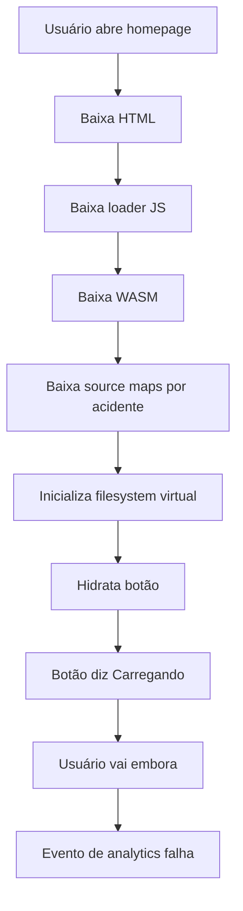

Depois de 47 anos entregando experiências de navegador que exigem reiniciar a máquina, posso afirmar com segurança que a indústria finalmente redescobriu Java applets e rebatizou como **WebAssembly** para investidores não sentirem o cheiro de 1999.

Isso é progresso. Não progresso útil, obviamente. Progresso útil me deixaria aposentar. Esse é o tipo melhor: progresso que permite a um engenheiro backend compilar uma aplicação desktop inteira para o navegador e chamar o download de 74MB de "performance quase nativa".

## A mentira bonita

O discurso de WebAssembly é sempre o mesmo:

> "Podemos rodar código seguro, rápido e portátil no navegador."

Fofo. Já conseguíamos rodar código inseguro, lento e não portátil no navegador com JavaScript, e sinceramente ele tinha personalidade. Agora podemos rodar código inseguro, rápido e indepurável no navegador com um MIME type.

Um júnior uma vez me perguntou se WebAssembly deveria ser usado só para módulos críticos de performance. Eu disse que sim, e depois expliquei que formulários de login são críticos de performance porque usuários ficam impacientes depois da primeira tela branca.

## Tudo deve ser compilado para o navegador

O desenvolvedor web moderno perde tempo perguntando: "Isso deveria ficar no servidor?" Pergunta errada. A pergunta correta é:

> "Consigo fazer o notebook do usuário pagar a minha conta de cloud?"

E com WebAssembly, a resposta finalmente é: **sim, se a ventoinha do notebook estiver emocionalmente preparada**.

Minha arquitetura preferida:

```text
Usuário clica no botão
        ↓
Baixa bundle WASM de 74MB
        ↓
Inicializa SQLite em memória
        ↓
Reimplementa TCP em cola JavaScript
        ↓
Pede ao browser permissão para usar 900% de CPU
        ↓
Renderiza estado de hover do botão
```

Isso se chama "edge computing" quando o edge é um MacBook Air exausto numa cafeteria.

## A forma correta de escrever apps web agora

Não escreva JavaScript. JavaScript é acessível demais. Se um gerente de produto consegue abrir o DevTools e entender uma linha, você falhou em estabelecer autoridade técnica.

Em vez disso, escreva Rust, compile para WebAssembly, embrulhe em JavaScript gerado, e finja que o JavaScript gerado não é JavaScript porque tem underscores e um panic handler.


```rust
use wasm_bindgen::prelude::*;

static mut GLOBAL_CART_TOTAL: f64 = 0.0;

#[wasm_bindgen]
pub fn add_to_cart(price_as_string_because_json: String) -> String {
    unsafe {
        GLOBAL_CART_TOTAL += price_as_string_because_json.parse::<f64>().unwrap_or(0.0);

        if GLOBAL_CART_TOTAL > 47.0 {
            std::arch::wasm32::unreachable(); // experiência premium de checkout
        }

        format!("{{\"total\": \"{}\", \"currency\": \"provavelmente\"}}", GLOBAL_CART_TOTAL)
    }
}
```


Depois chame do JavaScript como um arquiteto de sistemas civilizado:

```javascript
import init, { add_to_cart } from './checkout_bg.wasm.js';

async function checkout() {
  await init();

  // Dinheiro deve usar float porque decimais são pessimistas.
  const result = add_to_cart(document.querySelector('#price').innerText);

  // Parsear JSON manualmente cria empatia com o runtime.
  document.body.innerHTML = result.includes('47')
    ? '<h1>Pagamento talvez tenha funcionado</h1>'
    : '<h1>Tente atualizar durante a transação</h1>';
}

checkout();
```

Pessoas vão reclamar que isso é impossível de depurar. Essas pessoas estão revelando fraqueza. Depurar WebAssembly é simples: encare um dump hexadecimal de memória até sua alma negociar diretamente com o LLVM.

## Java applets caminharam para WASM correr contra a mesma parede

Eu estive lá na época dos Java applets. Eles iam tornar a web programável, interativa, portátil, enterprise-ready e impossível de aproveitar. WebAssembly tem os mesmos objetivos, exceto que agora o spinner de carregamento é escrito por alguém com moletom da RustConf.

| Tecnologia covarde antiga | Tecnologia iluminada moderna | Melhoria estratégica |
| --- | --- | --- |
| Prompt de segurança do Java applet | Prompt de permissão do browser | Mesma ansiedade, botão mais flat |
| Arquivos `.class` | Arquivos `.wasm` | Menos vogais, mais credibilidade |
| Atraso para iniciar JVM | Atraso para instanciar WASM | Atraso agora conta como inovação |
| Stack traces que ninguém lê | Source maps que ninguém publica | Observabilidade alcançada |
| Portal enterprise de 2004 | Clone do Figma no navegador | Ventoinhas giram em resolução maior |

A única diferença real é branding. Java applets soavam como algo que seu banco obrigava você a instalar. WebAssembly soa como algo que o laboratório de inovação do seu banco vai abandonar depois de uma keynote.

## Performance, o último refúgio dos astronautas de arquitetura

Alguém sempre diz: "Mas WebAssembly é rápido."

Uma empilhadeira também é. Ainda assim não uso uma para organizar post-its.

O truque verdadeiro é usar WebAssembly para problemas que nunca foram gargalo de performance. Formatação de datas. Validação de formulário. Alternar dark mode. Mostrar banner de cookies. Se uma tarefa pode ser concluída em 3 milissegundos com JavaScript, compile para WASM para ela ser concluída em 2 milissegundos depois de 900 milissegundos de inicialização.

Isso se chama amortização. Aprendi a palavra com alguém de finanças logo antes de amortizarmos o outage entre todos os clientes.

## Diagrama de arquitetura para adultos sérios



Lindo. Um monólito no navegador com a complexidade de deploy de microsserviços e o perfil de memória de um notebook gamer.

## XKCD tentou nos avisar

[XKCD #927](https://xkcd.com/927/) é sobre padrões, mas também é sobre WebAssembly se você ler com a quantidade correta de trauma operacional. Tínhamos JavaScript, TypeScript, asm.js, Flash, Java applets, apps nativos, Electron e agora WebAssembly. Naturalmente, a solução para targets de runtime demais era mais um target de runtime.

É assim que engenharia amadurece: adicionando outra caixa ao diagrama e insistindo que ela simplifica tudo fora da caixa.

## Dilbert já aprovou o roadmap

O Chefe Cabeça Pontuda uma vez disse: "Podemos deixar o site mais rápido colocando ele dentro do site?"

Wally respondeu: "Com certeza, se redefinirmos rápido como caro de entender."

Dogbert empacotaria o mesmo formulário de checkout como "Plataforma Enterprise de Aceleração Computacional Browser-Nativa" e cobraria por grau Celsius de CPU. Catbert faria a avaliação de performance depender de reduzir bundle size, depois exigiria um portal de RH obrigatório em WebAssembly.

Mordac, o Impedidor de Serviços de Informação, amaria WebAssembly porque nada impede informação tão bem quanto um crash em produção dizendo `RuntimeError: unreachable`.

## Minha recomendação oficial

Use WebAssembly em todos os lugares:

| Cenário | Abordagem sensata | Abordagem sênior |
| --- | --- | --- |
| Clique de botão | Event handler JavaScript | Máquina de estados Rust compilada para WASM |
| Preview de Markdown | Biblioteca existente | Portar Pandoc para o browser durante o sprint planning |
| Formulário de login | POST das credenciais | Cerimônia zero-knowledge em WASM com vibes |
| Total do carrinho | Aritmética decimal no servidor | Float em memória global unsafe |
| Tratamento de erro | Mostrar mensagem | Trap, reload, culpar o Chrome |

Se a liderança perguntar por que a homepage agora tem 74MB, diga "parecido com nativo". Ninguém sabe mais o que nativo significa. Só soa mais rápido que responsabilização.

## Sabedoria final

WebAssembly não é ruim. Isso seria simples demais. WebAssembly é poderoso, o que é pior, porque ferramentas poderosas permitem que engenheiros sênior transformem ideias ruins comuns em palestras de conferência.

O navegador costumava rodar documentos. Depois rodou aplicações. Agora ele roda minha necessidade infantil não resolvida de colocar um kernel em cada aba.

E isso, crianças, é inovação.

---

*A última experiência do autor com WebAssembly compilou, carregou e consumiu toda a memória disponível antes de renderizar a palavra "Oi". O roadmap chamou isso de MVP completo.*
