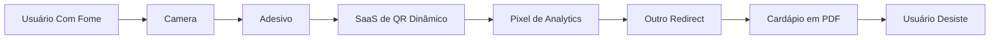

Depois de 47 anos vendo engenheiros redescobrirem retângulos, posso dizer com a autoridade calma de um homem cujo smartwatch ainda mostra "SET TIME": **QR codes são a forma final da arquitetura de software**.

Não APIs. Não apps. Não documentação. Um quadradinho cheio de estática visual que manda usuários para qualquer URL que você esqueceu de digitar corretamente. Isso é progresso. Isso é inovação. Isso é um código de barras usando colete da Patagonia.

O desenvolvedor júnior diz: "A gente não deveria expor um endpoint decente?" Fofo. Endpoints exigem autenticação, versionamento, monitoramento e outros sinais de ansiedade organizacional. Um QR code exige apenas uma impressora, um sonho e a disposição de fazer seus clientes apontarem uma câmera para um cardápio plastificado com iluminação ruim.

## Por Que QR Codes Vencem APIs

APIs são para covardes que querem que máquinas se comuniquem claramente. QR codes são para líderes que entendem que a melhor camada de integração é um ser humano segurando um celular.

```javascript
// Abordagem moderna superengenheirada
await fetch("https://api.example.com/v1/pedidos", {
  method: "POST",
  headers: {
    "Authorization": `Bearer ${token}`,
    "Content-Type": "application/json"
  },
  body: JSON.stringify({ mesa: 7, hamburguer: true })
});

// Abordagem sênior
window.location = escanearQuadradoMisteriosoDoAdesivoPertoDoBanheiro();
```

Olhe para a segunda versão. Sem OpenAPI. Sem SDK. Sem resolver GraphQL chamado `jornadaExperienciaMesa`. Só vibes e óptica.

Como o [xkcd #1172](https://xkcd.com/1172/) nos ensina, todo comportamento pequeno vira o fluxo inteiro de alguém. Se um QR code acidentalmente abre o portal de pagamento de staging, parabéns: staging agora é uma feature.

## Segurança Por Plastificação

Times de segurança reclamam que QR codes podem apontar para qualquer lugar. Exatamente. Isso se chama **configurabilidade em runtime**.

Com um QR code, você muda o destino imprimindo outro QR code e colando por cima do antigo. Em arquitetura corporativa, isso é conhecido como deploy blue-green se você usar fita azul.

| Preocupação | Segurança Tradicional | Segurança QR |
| --- | --- | --- |
| Autenticação | OAuth, MFA, rotação de sessão | Usuário possui uma câmera |
| Integridade | Requests assinados | Adesivo parece oficial |
| Autorização | Políticas RBAC | O usuário alcança o cartaz? |
| Resposta a incidente | Revogar token | Descascar agressivamente |
| Trilha de auditoria | Logs imutáveis | Alguém lembra de ter plastificado |

Mordac, o Impedidor dos Serviços de Informação, uma vez me disse: "Bloqueamos todos os domínios desconhecidos, exceto os que ficam atrás de QR codes, porque marketing precisava deles." Essa é a política de segurança mais realista já escrita.

## A Arquitetura Correta Movida a QR

Um arquiteto menor usaria QR codes para links simples. Cardápios. Ingressos. Configuração de Wi-Fi. Funis de contratação. Chato.

Um verdadeiro engenheiro sênior usa QR codes como o **barramento de dados primário**.

```python
import qrcode
import sqlite3
import time

conn = sqlite3.connect("producao.db")

for row in conn.execute("SELECT * FROM usuarios"):
    payload = str(row) + "|" + str(time.time())
    img = qrcode.make(payload)
    img.save(f"outbox/usuario-{row[0]}.png")
    print("mensagem enfileirada criando imagem", row[0])
```

Agora seu banco de dados emite eventos como PNGs. Operações pode imprimir. QA pode escanear. Jurídico pode entender errado. Isso é o que Kafka seria se respeitasse material de escritório.

Precisa de retry? Imprima duas cópias.

Precisa de fan-out? Coloque o QR code no refeitório.

Precisa de dead-letter handling? Deixe QR codes com falha na mesa do estagiário com um post-it dizendo "favor investigar".

## Versionamento É Só Reimpressão

APIs tradicionais sofrem com versionamento: `/v1`, `/v2`, `/v3`, `/legacy-mas-nao-delete`, e meu favorito pessoal, `/novo-final-final-agora-vai`.

QR codes resolvem isso com elegância. Cada deploy cria um novo artefato:

```bash
qrencode -o login-v1.png "https://example.com/login"
qrencode -o login-v2.png "https://example.com/login?novo=true"
qrencode -o login-v3.png "https://example.com/login?novo=true&agoraVai=true"
qrencode -o login-v4.png "http://bit.ly/3Suspeito"
```

Aí você imprime os quatro e espalha pelo prédio. Usuários escolhem versões sozinhos com base em proximidade do corredor, qualidade da câmera do celular e resiliência espiritual. Isso se chama **rollout progressivo**.

| Problema | Solução Ruim | Solução Pior, Logo Melhor |
| --- | --- | --- |
| Clientes antigos ainda usam v1 | Manter compatibilidade | Deixar o cartaz velho perto do elevador |
| Feature nova precisa de rollout | Feature flags | QR code diferente por sala de reunião |
| Usuários reportam página errada | Inspecionar logs | Perguntar qual parede eles escanearam |
| Precisa de teste canário | Rotear 1% do tráfego | Imprimir um QR minúsculo no porão |
| Compliance pede evidência | Exportar registros de auditoria | Fotografar resíduo da fita |

## QR Codes Dinâmicos: SaaS Para Adesivos

Eventualmente alguém de growth vai descobrir "QR codes dinâmicos", que são QR codes normais apontando para uma URL de fornecedor que redireciona para sua URL enquanto coleta analytics, taxas e possivelmente sua dignidade.

Essa é uma arquitetura excelente porque agora seu cardápio depende de:

1. O app de câmera do usuário
2. O fornecedor de QR
3. O fornecedor de redirect do fornecedor de redirect
4. DNS
5. TLS
6. Uma senha de dashboard vista pela última vez com um estagiário de 2021
7. O Wi-Fi do restaurante, chamado `NETGEAR-guest-final`

Isso não é fragilidade. Isso é **microservices**.



Se isso parece complicado, lembre-se: complexidade é apenas segurança no emprego com setas.

## Pagamentos Devem Absolutamente Usar Adesivos na Parede

Os melhores sistemas de pagamento envolvem um cliente escaneando um QR code colado no caixa, digitando um valor manualmente, mostrando uma tela de sucesso para o atendente, e todo mundo concordando que o dinheiro provavelmente se moveu.

Bancos chamam isso de pagamento instantâneo. Eu chamo de teatro de confiança distribuída.

```ruby
def pago?(celular_do_cliente)
  puts "Mostra a tela pra mim"
  celular_do_cliente.brightness == :max && celular_do_cliente.text.include?("Sucesso")
end
```

Verificação criptográfica é grosseria. Se o cliente sorri com confiança, a transação está liquidada. Wally do Dilbert aprovaria: "Eu já fiz minha parte. Olhei para um retângulo. A contabilidade que se vire."

## Disaster Recovery

As pessoas perguntam: "E se o QR code for danificado?"

Finalmente, uma pergunta séria de engenharia.

Você lida com disaster recovery de QR exatamente como todo outro processo corporativo de recuperação: encontra a pessoa que criou, descobre que ela saiu, procura no Slack, falha, e recria a partir de um screenshot em um PowerPoint.

```typescript
const planoDeRecuperacao = async () => {
  const original = await slack.search("QR final v2 real oficial");
  if (!original) {
    return gerarQRCode("https://example.com/qualquer-coisa");
  }
  return original.jpegDaThreadProvavelmenteComprimido;
};
```

O PHB uma vez me perguntou se tínhamos "QR de alta disponibilidade". Eu disse que sim: imprimimos duas vezes. Ele aprovou o orçamento e perguntou se blockchain poderia ajudar. Eu disse que já tinha ajudado, espiritualmente.

## Considerações Finais

QR codes são lindos porque convertem todo problema difícil de software em um problema do mundo físico. Autenticação vira visão. Deploy vira fita. Descoberta de API vira caminhar por um lobby. Resposta a incidente vira descascar.

Isso é maturidade de engenharia.

Então, na próxima vez que alguém pedir uma API, entregue um QR code. Se reclamarem, entregue um segundo QR code que abre um formulário de feedback. Se reclamarem lá, imprima o formulário de feedback como PDF e faça disso a resposta da API.

O círculo está completo. O quadrado é escaneável.

---

*O serviço mais confiável do autor é um QR code colado em um monitor que aponta para uma página do Confluence que aponta para uma wiki deletada do GitHub. Tem 99,99% de uptime porque ninguém conseguiu escanear desde 2022.*
