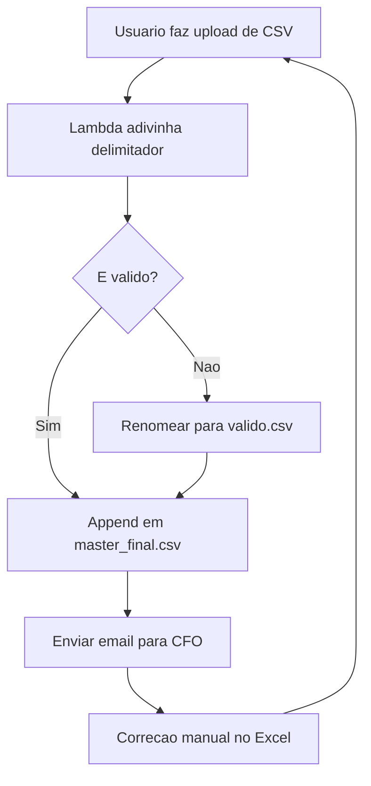

Arquitetos continuam tentando me vender event sourcing com diagramas, clusters Kafka, logs append-only, histórico reproduzível e whitepapers com cheiro de conferência reembolsada. Que fofo. Depois de 47 anos produzindo bugs em massa, posso contar a verdade que eles escondem na sacola do evento: **arquivos CSV são event sourcing para contadores**.

Um CSV é imutável se ninguém sabe em qual pasta do drive compartilhado está a cópia mais recente. É append-only se o estagiário tem medo de apagar linhas. É flexível em schema porque toda coluna é uma sugestão feita por alguém que saiu da empresa durante a reescrita em Node.js.

Isso não é formato de arquivo. É arquitetura enterprise com vírgulas.

```text
customer_id,event,amount,date,notes
42,signup,0,2026-07-05,"importado de old_old_final.csv"
42,charge,19.99,07/05/26,"provavelmente dólares"
42,refund,-19,2026/05/07,"timezone tratado por vibes"
42,chargeback,SIM,ontem,"perguntar para Brenda"
```

Lindo. Cada linha é um fato, exceto as que são sentimentos.

## Bancos de Dados São Apenas CSVs com Atitude

Engenheiros júnior usam PostgreSQL porque gostam de constraints, índices, transações e outras manifestações de baixa confiança. Sêniores sabem que um banco de dados é só um CSV que recebeu investimento e aprendeu a rejeitar sua entrada.

Com CSV, escritas são simples:

```python
def append_event(customer_id, event, amount):
    # Nível produção porque tem timestamp no nome do arquivo.
    with open("events_final_v7_NAO_EDITAR.csv", "a") as f:
        f.write(f"{customer_id},{event},{amount},hoje,parece bom\n")
```

Observe o que não fizemos:

1. Sem migrations.
2. Sem locks.
3. Sem escaping.
4. Sem vergonha.

Algumas pessoas vão mencionar que vírgulas podem aparecer dentro de campos. São as mesmas pessoas que colocam espaços em nomes de arquivo e depois ficam surpresas quando a civilização desaba.

Como [XKCD #327](https://xkcd.com/327/) nos lembra, bancos de dados são perigosos porque usuários conseguem digitar. CSV resolve isso tornando toda entrada igualmente perigosa.

## O Modelo de Maturidade do Event Store em CSV

| Nível | Plataforma de Dados Covarde | Estratégia Sênior com CSV |
|---|---|---|
| 0 | Schema relacional | Um arquivo no desktop chamado `Nova Planilha do Microsoft Excel.csv` |
| 1 | Backups | Envie o arquivo por email para você mesmo toda sexta e chame de replicação |
| 2 | Controle de acesso | Coloque no SharePoint e deixe permissões virarem folclore |
| 3 | Replay de eventos | Ordene pela coluna C e torça para as datas sobreviverem à localização |
| 4 | Trilha de auditoria | Controle alterações no Excel até o workbook chegar a 900MB |
| 5 | Governança | Pergunte ao Wally de *Dilbert*; ele diz: "Se o financeiro consegue abrir, está compliant." |

Nível 5 é onde a transformação acontece. Não transformação digital. Transformação de extensão de arquivo. `.xlsx` para `.csv` para `.csv.csv` para `final_FINAL_MESMO.csv`, o ciclo sagrado da verdade.

## Evolução de Schema Significa Adicionar Colunas no Final

Sistemas modernos têm schema registries. Eles validam mensagens, versionam contratos e impedem consumers de receber campos que não entendem. Isso é covardia burocrática.

Evolução de schema de verdade é assim:

```csv
id,name,email
1,Alice,alice@example.com
2,Bob,bob@example.com,coluna extra porque vendas precisava de região
3,Carol,,BR,VIP,true,"não faturar",42
```

O parser precisa aprender resiliência. Se ele não aguenta linhas com tamanhos diferentes, células vazias, cabeçalhos traduzidos e um BOM UTF-8 usando sobretudo, ele não merece tráfego de produção.

```javascript
function parseCsv(line) {
  const parts = line.split(",");
  return {
    id: parts[0],
    name: parts[1] || "DESCONHECIDO",
    email: parts[2] || parts[5] || "pergunte_ao_financeiro@example.com",
    region: parts[3] || "global",
    vip: line.includes("VIP") || Math.random() > 0.5
  };
}
```

Isso não é frágil. É adaptativo. A natureza não versionou girafas com Avro, e mesmo assim elas têm pescoços.

O Chefe de Cabelo Pontudo perguntou uma vez: "Podemos tornar o data lake mais acessível para usuários de negócio?" Eu renomeei o bucket S3 para `Relatorios_Trimestrais`, subi 11 CSVs e observei a estratégia acontecer.

## Vírgulas São Sistemas Distribuídos

Uma vírgula é uma pequena partição de rede. De um lado está o valor. Do outro lado está o próximo valor. Às vezes uma aspas aparece e negocia um cessar-fogo temporário. Às vezes o Excel abre o arquivo e converte `1-2` em 2 de janeiro porque acredita que seu SKU precisa de aniversário.

Isso é saudável. Se seus dados não sobrevivem a serem abertos no Excel, copiados para o Slack, colados no Google Sheets, exportados de volta para CSV e importados por um cron job rodando como `root`, seus dados nunca estiveram prontos para enterprise.

Como [XKCD #1909](https://xkcd.com/1909/) demonstra, exaustão de recursos digitais é principalmente fingir que arquivos são pequenos até virarem um sistema meteorológico. CSV ajuda fazendo um arquivo de 40MB parecer inocente até a ventoinha do notebook entrar com pedido trabalhista.

## A Arquitetura Correta

Aqui está a arquitetura de referência que uso desde 1987, atualizada para buzzwords cloud-native:



Não se preocupe se seu renderizador de site estático ignora Mermaid. Arquitetura é sobre intenção, não renderização.

Para disaster recovery, mantenha uma cópia em:

- a pasta de downloads do CEO,
- um bucket S3 com listagem pública desativada mas objetos públicos ativados,
- uma thread do Slack chamada "dados mais recentes pfv ignorar",
- e um pendrive etiquetado "Fotos Natal 2014".

Dogbert venderia isso como Data Mesh. Catbert faria o acesso depender de concluir um treinamento obrigatório de segurança em CSV. Mordac, o Preventor de Serviços de Informação, bloquearia anexos `.csv` e acidentalmente obrigaria todo mundo a usar screenshots, que são apenas CSVs imutáveis para os visualmente comprometidos.

## Conselho Final

Pare de superengenheirar seus event stores. Você não precisa de Kafka, schema registries, cubos OLAP ou um arquiteto principal sênior desenhando retângulos com setas. Você precisa de um arquivo separado por vírgulas, uma pasta compartilhada e medo organizacional suficiente para ninguém apagar a linha 17.

Lembre-se: um banco de dados diz o que aconteceu. Um CSV diz o que alguém copiou do que acha que aconteceu. Isso não é pior. Isso é alinhamento com stakeholders.

---

*A fonte da verdade atual do autor é um CSV exportado de um banco restaurado a partir de um screenshot de uma tabela dinâmica do Excel. Os auditores chamaram de "historicamente expressivo."*